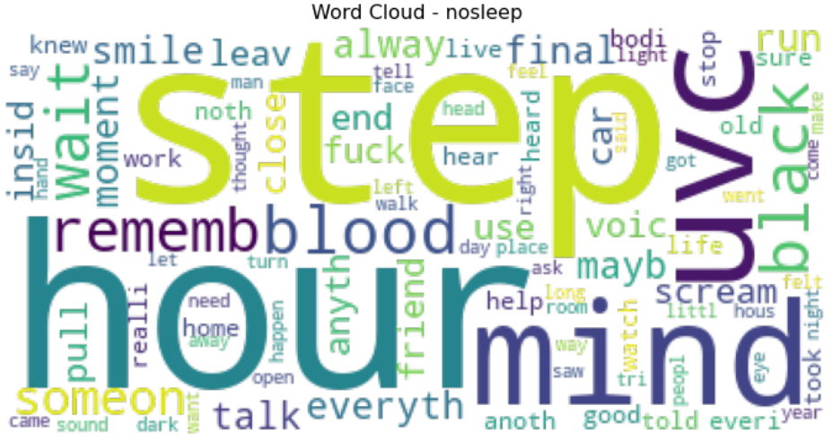
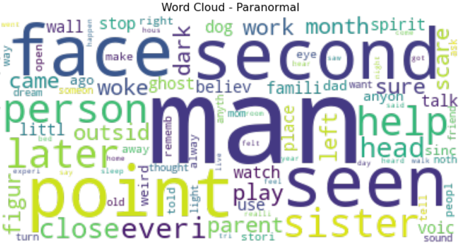

#  Project 3: Web APIs & NLP
By Yong Fah Aik

### Overview
[Reddit](https://www.reddit.com) is a network of communities where people can dive into their interests, hobbies and passions. Subreddits are user-created channels where discussion on the topic of interest, hobby or passion are organized. From [Metrics For Reddit](https://frontpagemetrics.com/history), there are over 3.2 million subreddits as of December 2021, with hundreds of subreddits being created every day. 

### Problem Statement
As there are many different subreddits on Reddit, and since interests, hobbies and passions can be similar, there are always various subreddits that are similar to each other. Without a doubt, anyone who is new to writing and posting to Reddit can be confused as to which subreddit to post to. 

In this project, the aim is to assist the new Reddit user in the decision of which subreddit to make the post in, through the use of classification models based on the analysis of the posts of the subreddits.

For the context of this project, the post is in the form of a scary experience, and the choices of the subreddits the new Reddit user has for making the post are [nosleep](https://www.reddit.com/r/nosleep/) and [paranormal](https://www.reddit.com/r/paranormal/), two subreddits that cater to scary personal experiences and paranormal experiences, thoughts and theories. 

To determine how successful the classification model is, the **accuracy** of the model as well as the **specificity** of the model will be the defining factors. Choosing accuracy is obvious as having the post going to the wrong subreddit is a bad idea, but choosing specificity as well is due to the fact thatt the `nosleep` subreddit has strict posting requirements, and thus it will be good to reduce the possibility of the post being wrongfully posted to the `nosleep` subreddit and having the post removed.

At the end of this project, by determining the top root word features of each subreddit, we will better assist in the decision-making process of the user based on the given post.

---
### Dataset
In this project, the data of are scraped from the chosen subreddits, [nosleep](https://www.reddit.com/r/nosleep/) and [paranormal](https://www.reddit.com/r/paranormal/), through the use of [PushShift's API](https://github.com/pushshift/api). Data Cleaning is then performed and some preliminary text preprocessing is performed and compiled into a csv for the purpose of this project. The final dataset used can be found in the [`datasets`](./datasets/) folder for this project.

### Data Dictionary
The following variables can be found in the final dataset used for the modelling and analysis.

|Feature|Data Type|Description|
|:--:|:--:|:----------:|
|**subreddit**| Integer | Target Class, 1 for `r/nosleep`, 0 for `r/Paranormal` |
|**text**| String | Concatenated string of `title` and `selftext` (body) of post |
|**text_stop**| String | Variable **text** after tokenizing to extract words and stop words are removed |
|**text_lem**| String | Variable **text_stop** after lemmatization is performed |
|**text_stem**| String | Variable **text_stop** after stemming is performed |

---

### Executive Summary

**Summary of Models:** 
The Baseline Model is based on the assumption of taking every post to be of the target subreddit. After that, the modelling of the data is based on the combination of the 2 transformers (**Count Vectorizer** & **Tf-idf Vectorizer**) and the 4 estimators (**Naive Bayes Multinomial**, **Logistics Regression**, **K Neighbors Classification** & **Random Forest Classifier**). GridSearchCV is used to search the various hyperparameters of the models in order to find the best model. 

|Model|Transformer|Train Score|Test Score| TN | FP | FN | TP | Specificity | Sensitivity | F1 | ROC AUC |
|:--:|:--:|:--:|:--:|:--:|:--:|:--:|:--:|:--:|:--:|:--:|:--:|
|**Baseline**|**None**| 0.431463 | 0.429752 | -- | -- | -- | -- | -- | -- | -- | -- |
|**Naive Bayes**|**Count Vectorizer**| 0.9466 | 0.9366 | 197 | 10 | 13 | 143 | 0.9517 | 0.9167 | 0.9256 | 0.9342 |
|**Naive Bayes**|**Tf-idf Vectorizer**| 0.9512 | 0.9477 | 203 | 4 | 15 | 141 | 0.9807 | 0.9038 | 0.9369 | 0.9423 |
|**Logistics Regression**|**Count Vectorizer**| 0.9991 | 0.9532 | 199 | 8 | 9 | 147 | 0.9614 | 0.9423 | 0.9453 | 0.9518 |
|**Logistics Regression**|**Tf-idf Vectorizer**| 0.9687 | 0.9559 | 202 | 5 | 11 | 145 | 0.971 | 0.9295 | 0.9477 | 0.9527 |
|**K Neighbors Classifier**|**Count Vectorizer**| 0.7682 | 0.7824 | 207 | 0 | 79 | 77 | 1.0 | 0.4936 | 0.6609 | 0.7468 |
|**K Neighbors Classifier**|**Tf-idf Vectorizer**| 0.9218 | 0.865 | 183 | 24 | 25 | 131 | 0.8841 | 0.8397 | 0.8424 | 0.8619 |
|**Random Forest Classifier**|**Count Vectorizer**| 1.0 | 0.9366 | 197 | 10 | 13 | 143 | 0.9517 | 0.9167 | 0.9256 | 0.9342 |
|**Random Forest Classifier**|**Tf-idf Vectorizer**| 1.0 | 0.9449 | 200 | 7 | 13 | 143 | 0.9662 | 0.9167 | 0.9346 | 0.9414 |

The Final Model selected based on *accuracy* with *specificity* taken into consideration is the **Logistics Regression** Model with **Tf-idf Vectorizer** transformer.

The GridSearchCV hyperparameters chosen are:    
'tvec__max_df': 0.7, 'tvec__max_features': 2000, 'tvec__min_df': 1, 'tvec__ngram_range': (1, 1)

|Model Statistics|Scores|
|:--:|:--:|
|Test Score| 95.59% |
|Specificity| 97.1% |
|Sensitivity| 92.95% |
|F1 Score| 94.77% |
|ROC/AUC| 0.9527 |
|Misclassification| 4.41% |

---
**Key takeaways:** 

Word Clouds of the two subreddits [Top occuring words after stop words (including common words) are removed]: 

---

### Recommendations

By looking at the coefficients for the Final Model, we arrived at the following 20 word features with the highest values and the lowest values for their coefficients. 

|r/nosleep|r/Paranormal|
|:--:|:--:|
| hand | experiment |
| eye | spirit |
| blood | anyone |
| want | haunt |
| said | happen |
| scream | experience |
| wait | ghost |
| head | weird |
| try | room |
| let | saw |
| began | cat |
| fuck | idk |
| day | post |
| came | skeptic |
| everything | bed |
| knew | bedroom |
| slowly | story |
| took | active |
| face | dream |
| leave | live |

As such, through the comparison of the given post with the above word features, the reddit user is now more capable of making a better decision in which subreddit to post to.

**Misclassifications:**    
Type I Errors (False Positives):    
For `r/Paranormal` posts wrongly predicted as `r/nosleep`, misclassification may be due to use of words 'said' & 'face' that are related to `r/nosleep`.

Type II Errors (False Negatives):   
For `r/nosleep` posts wrongly predicted as `r/Paranormal`, misclassification may be due to use of words 'room', 'post', 'bed', 'cat', 'grandpa' that are related to `r/Paranormal`. Also, it should be noted that the misclassed posts also contain various non-English words that may skew the predictions.

---

### Conclusions 

The final model chosen for this project is the `Logistics Regression` model with the `Tfidf Vectorizer` transformer, with an accuracy score of `95.59%` and a specificity score of `97.58%`. 

Even though these scores are impressive, it should be noted that all of the models are based on their default parameters. These meant that there can be further improvements to the model if the parameters of the model are also adjusted to be optimal. In this case, this may be important as the default model may not be the best even though adjustments have been made in the Grid Search process to alter the parameters of the transformer. Of course, the time taken to complete each Grid Search will be exponentially increased, and thus this might not be the best way to conduct this process of optimization.

In the future, it might be good to reduce the amount of parameters chosen for the transformer and add the parameters for the model into the modelling process to refine the models in order to decide on the best model possible for the purpose of classification.

--

Due to the time constraint, it should be noted that text analysis is based on the text after stemming is done on it, and the model is thus based on those text. As `Porter Stemmer` is an aggressive form of text processing, the words generated may be inaccurate to their original meaning or even indecipherable at first glance. 

For future work, further analysis can be done on the other forms of pre-processing of the text, which includes no stemming or lemmatization, and other forms of text lemmatization or stemming.

--

While it can be seen that the final model is doing quite well for the two subreddits chosen, there is an inherent issue here. The two subreddits chosen are of the text-heavy variety and they are not entirely similar in terms of the topic of interest. This means that the adaptation of this model to other subreddits may not work out that well. It should also be noted that there are usually more than two subreddits that are quite similar to each other, and since this model is currently catered towards working with two subreddits, that means more work to be done in the selection of the model.

For future progress, the aim is to work towards adapting this model to a subreddit that is less text-heavy as well as adapting to subreddits that are very similar to each other would be more useful to the user. After that, it might be prudent to work towards multi-classification which is currently beyond the scope of this project.
